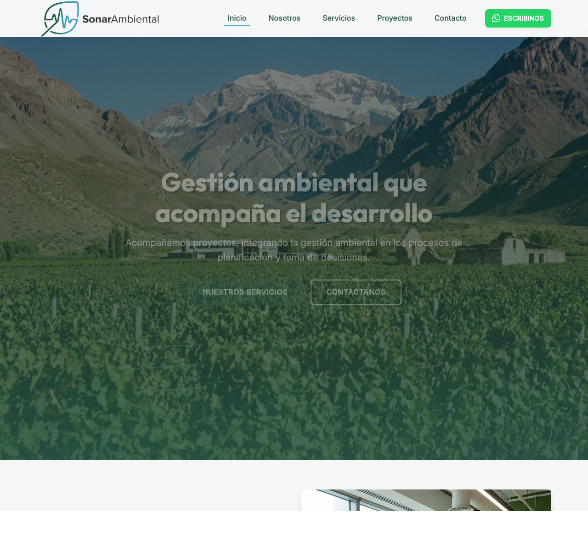

# SonarAmbiental Website

Sitio web corporativo para **SonarAmbiental**, una consultora líder en gestión ambiental, sostenibilidad y evaluación de impacto ambiental en Mendoza y la región de Cuyo.

El sitio está diseñado para transmitir profesionalismo, confianza y compromiso con el desarrollo sostenible, ofreciendo una experiencia de usuario moderna y accesible.



## 📋 Características del Proyecto

Este proyecto es una **Landing Page Multi-sección** estática, optimizada para velocidad y SEO, construida con tecnologías web estándar:

*   **HTML5 Semántico**: Estructura clara y accesible.
*   **CSS3 Moderno**: Diseño adaptativo (Responsive Design), variables CSS para gestión de temas y animaciones sutiles.
*   **JavaScript Vanilla**: Interactividad ligera sin dependencias pesadas.

## 🚀 Estructura del Sitio

La web se divide en las siguientes secciones principales:

*   **Inicio (`index.html`)**: Presentación de valor, resumen de servicios y testimonios destacados de clientes como YPF, Temis S.A., y más.
*   **Nosotros (`nosotros.html`)**: Historia de la consultora, misión, visión, valores y presentación del equipo profesional.
*   **Servicios (`servicios.html`)**: Detalle de las soluciones ofrecidas (Evaluación de Impacto, Auditorías, Gestión de Residuos, etc.).
*   **Proyectos (`proyectos.html`)**: Portfolio de casos de éxito con fichas técnicas detalladas de cada trabajo realizado.
*   **Contacto (`contacto.html`)**: Formulario de consulta, mapa de ubicación y acceso directo a WhatsApp.

## 📱 Diseño Responsive

El sitio se adapta a todos los dispositivos, asegurando una correcta visualización en móviles, tablets y escritorio.

| Desktop | Mobile |
|Str |Str |
|  |  |

## 🛠️ Cómo ejecutar localmente

Puedes servir la página web localmente utilizando Python (pre-instalado en macOS):

1.  Abre una terminal en esta carpeta.
2.  Ejecuta el siguiente comando:

```bash
python3 -m http.server
```

3.  Abre tu navegador en `http://localhost:8000`.
